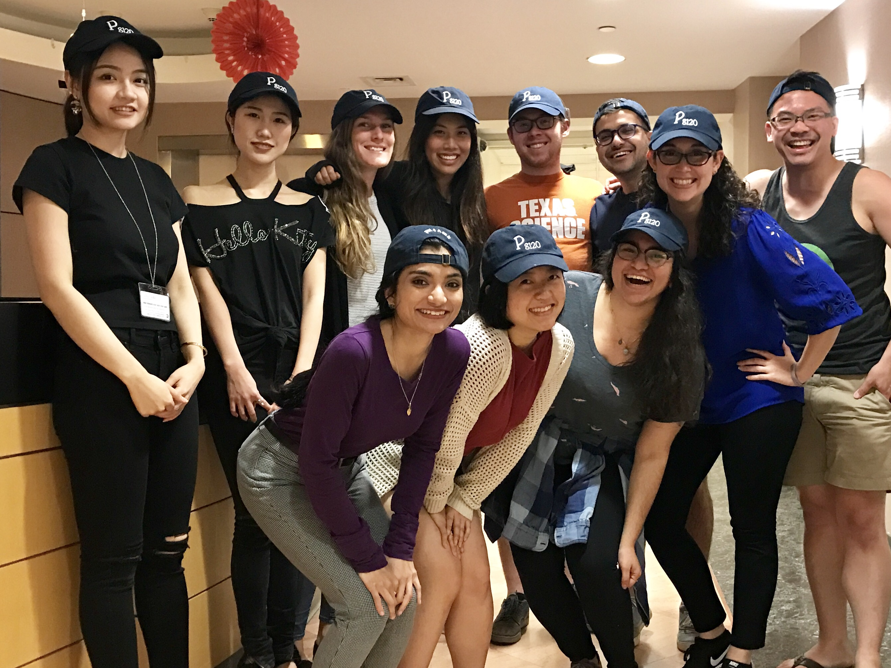

<link rel="stylesheet" href="academicons.css"/>
<link rel="stylesheet" href="styles.css" type="text/css">

  

## Current courses

Fall 2018: Research Methods and Applications: Quantitative Foundations  

## Past courses

* Summer 2017, 2018: Writing a Successful NIH Grant Application (co-taught, 30 students)  
* Spring 2016, 2017, 2018: Analysis of Categorical Data (170-200 students)  
* Summer 2010, 2011, 2012: Introduction to Biostatistical Methods (30-45 students) 

## Other selected lectures

2018:

* *Using Survey Data to Understand the Impact of Medical Marijuana Laws.* Oral presentation at workshop on Epidemiology and Public Health Research Methods, College on Problems of Drug Dependence Annual Meeting, San Diego, CA. [Slides](downloads/mauro_cpdd_june2018.pdf)

* *Getting Started with SAS (Part 1 and Part 2).* Mini-course sponsored by the Irving Institute for Clinical and Translational Research - Biostatistics, Epidemiology and Research Design Resource at Columbia University [(BERD)](http://irvinginstitute.columbia.edu/resources/biostatistics.html), New York, NY. [Slides Part 1](downloads/SAS_Minicourse1.pdf); [Slides Part 2](downloads/SAS_Minicourse2.pdf)

2017:

* *What to Expect From your Statistical Reviewer.* Oral Presentation at the Biostatistics in Action: Tips for Clinical Researchers Lecture Series sponsored by the Irving Institute for Clinical and Translational Research - Biostatistics, Epidemiology and Research Design Resource [(BERD)](http://irvinginstitute.columbia.edu/resources/biostatistics.html) at Columbia University, New York, NY. [Video](https://youtu.be/kK787j6j6BQ)

2015:

* *Logistic Regression with SAS.* Lecture at the NYC DOHMH Cross-Cutting Data Analysis Meeting. [Slides](downloads/cmauro_LogRegres_SAS.pdf)